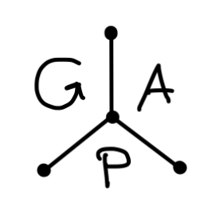
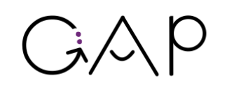
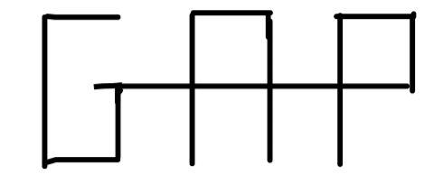
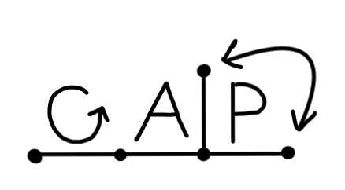
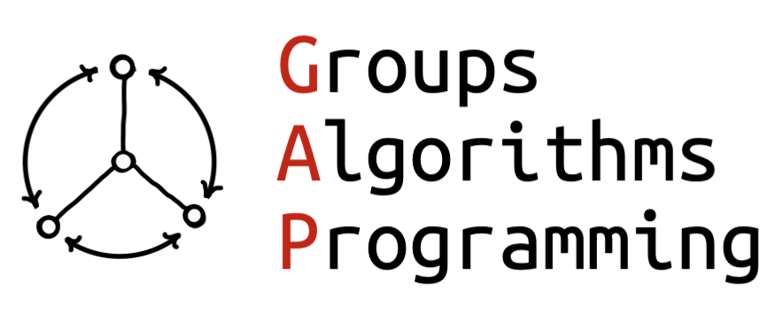

# GAP logo contest

This contest is about designing an official logo for the GAP computer algebra system, to be used on our website <https://www.gap-system.org> and also for research posters, application icons, stickers, mugs, and so on. The logo may use colors (and the color scheme of the website can be adapted to match the logo), but a B&W version should also be created.

We are looking for a logo that reflects what GAP is. To that end we provide some extra information and inspiration below, after the rules of the contest.

The contest is run by the **GAP logo contest committee** (GLCC) consisting of
- Jan De Beule (organizer of next GAP Days Spring 2025)
- Ruth Hoffmann (organizer of last GAP Days Summer 2024)
- Max Horn (current GAP coordinator)

If you have any questions about the contest please contact the GLCC by sending an email to <logo@gap-system.org>.

{: .note }
> The finalist designs are now [online here](finalists/) -- you can view them with both dark and light background.
> 
> You can still [register to vote](#rules-and-conditions-for-voting) as described below.

## Prizes

- The main prize will be eternal gratitude of the GAP Team and the GAP community ;-)
- Our website will of course attribute the logo to its creator properly.
- The winner will receive a free collection of GAP memorabilia made with the new logo (e.g. T-shirt, mug, stickers, etc.).
- In addition if the winner is present at the GAP Days in Brussels, they will receive a nice gift basket with local specialities.

## Rules and conditions for participating

- Submit your logo design via email to <logo@gap-system.org> with subject "GAP Logo submission".
    - You may submit up to three distinct designs.
    - Please send only one logo per email.
    - We aim to confirm receipt your submission within a few working days.
    - You must explicitly confirm in your submission email that ...
        - you have the full personal copyright on the logo and are not using stock art, 3rd party designs/designers or AI creations, and
        - if you win, you will grant the GAP Project exclusive usage rights for the logo and derived works in perpetuity.
- The selection process consists of two stages. 
    - Stage 1 is the submission of an initial sketch, with some explanations surrounding the idea and colour scheme.
    - Stage 2 will consist of a shortlist of designs. Their creators will be asked to submit a full-fledged version of their design (possibly together with a request for minor revisions) from which the winner is selected during GAP Days Spring 2025.
- Timeline
    - 28th February 2025: Deadline for submissions (stage 1)
    - 7th March 2025: Contestants are notified about result
    - 31st March 2025: Deadline for final submissions (stage 2)
    - 4th April 2025: Stage 2 submissions are [published as PNGs on this page to enable](finalists/) voting
- The winning design will be selected during GAP Days Spring 2025 (7th-11th April 2025 at Vrije Universiteit Brussel, Belgium) by an anonymous online vote
- Things to submit in ***stage 1***:
    - A draft logo in any standard format (JPEG, PNG, PDF, SVG, ...), 
    - An explanation as to what the logo represents and why it is appropriate for GAP.
    - (optional at this stage) Showcase how variants of the logo might look (e.g. suitable for favicon/thumbnail/t-shirts/stickers; also a black&white variant)
- Things to submit in ***stage 2***: 
    - A high-resolution resp. vector format version of the logo design, plus
        - a B&W variant (if the primary logo uses color),
        - bonus: an icon variant fitting into a 128x128 square
        - bonus: a [favicon](https://en.wikipedia.org/wiki/Favicon) variant for use on the website
    - Creators might receive suggestions for minor revisions of the logo, which we would encourage to do before submitting to stage 2.

## Rules and conditions for voting

- To be eligible to vote you must either ...
  - have contributed non-trivially to GAP itself,
  - be author or maintainer of a distributed GAP package,
  - be an active participant of GAP Days Spring 2025,
  - or otherwise establish that you have an active interest in the success of GAP.
- The GLCC ultimately determines whether these criteria are satisfied.
- To vote you need to first register by sending an email to <logo@gap-system.org> with subject "GAP Logo voter registration" before 7 April 2025, 16:00 (CET).
- Registered voters will receive information on how to vote by email before the end of 7 April 2025 and will then immediately be able to vote.
- Voting ends 9 April 2025, 18:00 / 6 pm (CET)

## Useful information for participants

### What is GAP?

To quote our website:

> GAP (short for "**G**roups, **A**lgorithms, **P**rogramming") is a system for computational discrete algebra, with particular emphasis on Computational Group Theory. GAP provides a programming language, a library of thousands of functions implementing algebraic algorithms written in the GAP language as well as large data libraries of algebraic objects. GAP is used in research and teaching for studying groups and their representations, rings, vector spaces, algebras, combinatorial structures, and more. The system, including source, is distributed freely. You can study and easily modify or extend it for your special use.

GAP is for researchers and other experts. It is not for school level mathematics.

### Some ideas to get you started

- The core topic of GAP, "group theory", deals with symmetry. For example:
    - The [wikipedia page on group theory](https://en.wikipedia.org/wiki/Group_theory) has some pictures related to this.
    - Lots of nice geometry is associated to e.g. Coxeter/reflection groups, e.g. [hyperbolic tessellations](https://sites.tufts.edu/verseimreu/files/2021/01/image.png)
    - Many related topics have graphical associations, e.g. [Dynkin diagrams](https://duckduckgo.com/?q=dynkin+diagram&t=osx&iax=images&ia=images),
      [subgroup lattices](https://duckduckgo.com/?q=subgroup+lattice&t=osx&iax=images&ia=images),
      [butterfly diagram in the Zassenhaus lemma](https://en.wikipedia.org/wiki/Zassenhaus_lemma) 
- if any mathematical "pictures" are included, it would be preferable if they were still somewhat recognizable by "many" algebraists; so not things that are super specialized (this can of course be hard to judge...)
- GAP is free (you don't have to pay) and open source. That means everyone can "get the source code" and thus see how it work; and thus also modify it and extend it as they like.

### Things to avoid

Any of the points below may lead to your design being outright rejected.

- It should not resemble the logo of the famous GAP fashion company
- No "stereotypical math-y looking stuff" like 𝜋, crazy formulas with integrals etc -- it's not that kind of math
- The name "GAP" is an acronym and has nothing to do with a physical "gap", so e.g. please no puns on "mind the gap" and the like
- Do not add any GAP version number in the logo.
- The color scheme on our website is there for historic reasons. We can and will adapt it to the logo, so don't feel obliged to use it in any way.
- There is an existing logo that some people use for GAP, see <https://avatars.githubusercontent.com/u/5344223> -- however you are in no way required or expected to take any of it into account (in particular, don't feel obliged to reference its color scheme or shape). That said, if you are the original creator/holder of the copyright of this logo, you are welcome to submit it or a variant.

### Some doodles as inspiration

The following are some old doodles. Feel free to take them as inspiration or to ignore them as you wish.

